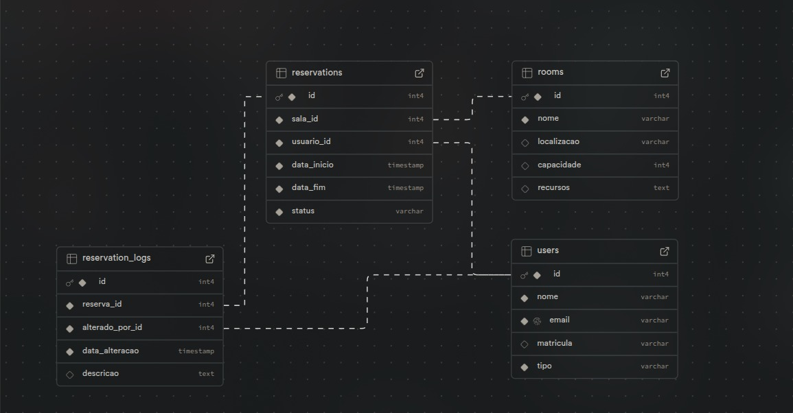

# 📅 WAD - Reserva de Salas

## 🎯 Introdução

O projeto **Reserva de Salas** foi desenvolvido para o **Inteli** com o objetivo de otimizar o processo de agendamento de salas de reunião, centralizando todas as reservas em um único sistema web. Este sistema foi criado para resolver a desorganização enfrentada na gestão das salas, oferecendo uma solução que permite visualizar salas disponíveis, solicitar reservas para horários específicos e acompanhar o status da solicitação.

A estrutura do banco de dados foi projetada para suportar as principais funcionalidades do sistema, como a gestão de salas, usuários e reservas. A seguir, apresentamos o diagrama que ilustra a modelagem do banco de dados, mostrando as entidades principais e seus relacionamentos.

## 📊 Diagrama do Banco de Dados

O diagrama abaixo apresenta a estrutura relacional do banco de dados, detalhando as tabelas e suas interações no contexto do sistema **Reserva de Salas**.

