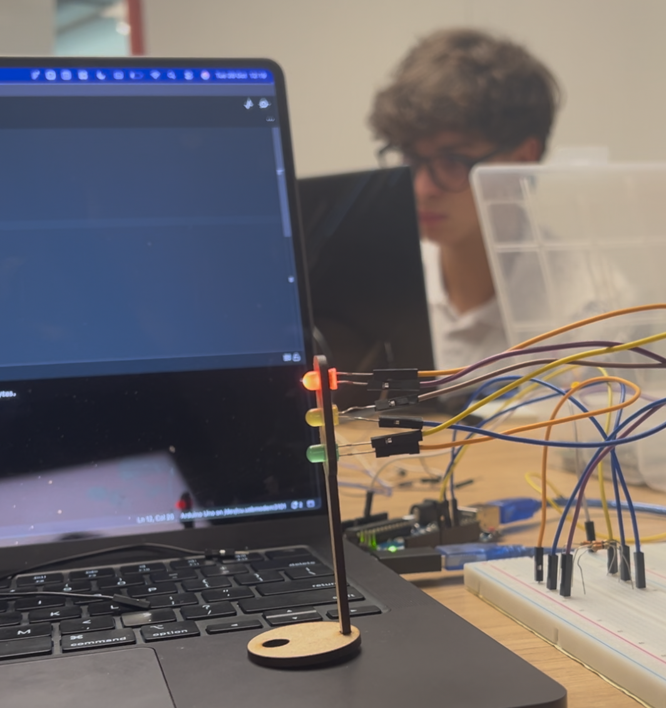
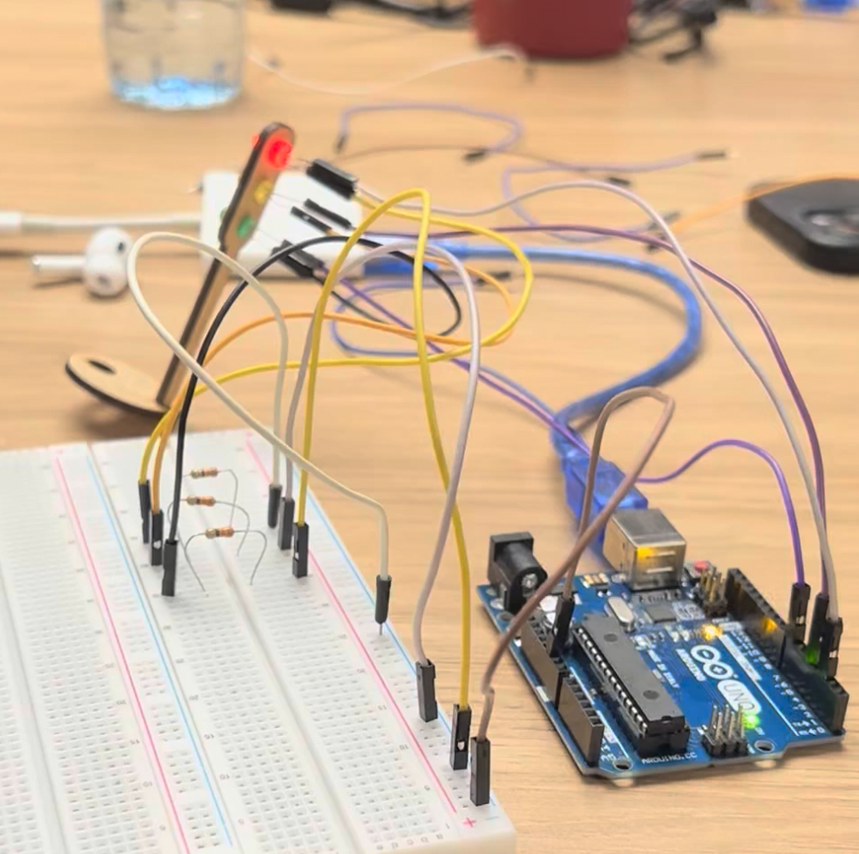

# Atividade 2 - Módulo 4

## Vídeo Demonstrativo

[Clique aqui para assistir ao vídeo demonstrativo](https://www.youtube.com/watch?v=0m2REz79Gig)

Ou acesse diretamente: https://www.youtube.com/watch?v=0m2REz79Gig

## Código Arduino

```cpp
const int ledVermelho = 2;
const int ledAmarelo = 4;
const int ledVerde = 7;

unsigned long tempoAnterior = 0;
int estado = 0;

unsigned long* ptrTempoAnterior = &tempoAnterior;
int* ptrEstado = &estado;

const unsigned long tempoVermelho = 6000;
const unsigned long tempoVerde = 4000;
const unsigned long tempoAmarelo = 2000;

void setup() {
  pinMode(ledVermelho, OUTPUT);
  pinMode(ledAmarelo, OUTPUT);
  pinMode(ledVerde, OUTPUT);
}

void loop() {
  unsigned long tempoAtual = millis();

  if (*ptrEstado == 0) {
    digitalWrite(ledVermelho, HIGH);
    digitalWrite(ledAmarelo, LOW);
    digitalWrite(ledVerde, LOW);

    if (tempoAtual - *ptrTempoAnterior >= tempoVermelho) {
      *ptrEstado = 1;
      *ptrTempoAnterior = tempoAtual;
    }
  }
  else if (*ptrEstado == 1) {
    digitalWrite(ledVermelho, LOW);
    digitalWrite(ledAmarelo, LOW);
    digitalWrite(ledVerde, HIGH);

    if (tempoAtual - *ptrTempoAnterior >= tempoVerde) {
      *ptrEstado = 2;
      *ptrTempoAnterior = tempoAtual;
    }
  }
  else if (*ptrEstado == 2) {
    digitalWrite(ledVermelho, LOW);
    digitalWrite(ledAmarelo, HIGH);
    digitalWrite(ledVerde, LOW);

    if (tempoAtual - *ptrTempoAnterior >= tempoAmarelo) {
      *ptrEstado = 0;
      *ptrTempoAnterior = tempoAtual;
    }
  }
}
```

## Componentes Utilizados

| Componente                          | Quantidade | Descrição / Função                                                      |
| ----------------------------------- | ---------- | ----------------------------------------------------------------------- |
| LED Vermelho                        | 1          | Indica o sinal de pare no farol.                                        |
| LED Amarelo                         | 1          | Indica o sinal de atenção (transição entre verde e vermelho).           |
| LED Verde                           | 1          | Representa o sinal de siga (livre) no farol.                            |
| Arduino Uno                         | 1          | Microcontrolador responsável por controlar os LEDs e a lógica do farol. |
| Resistores                          | 3          | Limitam a corrente dos LEDs, evitando que queimem.                      |
| Jumpers (macho-macho / macho-fêmea) | 10         | Realizam as conexões entre o Arduino, os resistores e os LEDs.          |
| Estrutura de madeira (suporte)      | 1          | Suporte físico no formato de farol, onde os LEDs foram encaixados.      |

## Fotos da Montagem

### Foto 1 - Vista Geral



### Foto 2 - Detalhe da Montagem



## Avaliação entre Pares

### Avaliador: Guilherme Schmidt

| Critério                                                                                                            | Contempla (Pontos) | Contempla Parcialmente (Pontos) | Não Contempla (Pontos) | Observações do Avaliador                          |
| ------------------------------------------------------------------------------------------------------------------- | ------------------ | ------------------------------- | ---------------------- | ------------------------------------------------- |
| Montagem física com cores corretas, boa disposição dos fios e uso adequado de resistores                            | Até 3              | Até 1,5                         | 0                      | Cores corretas com fios devidamente conectados, 3 |
| Temporização adequada conforme tempos medidos com auxílio de algum instrumento externo                              | Até 3              | Até 1,5                         | 0                      | O tempo está correto em cada led, 3               |
| Código implementa corretamente as fases do semáforo e estrutura do código (variáveis representativas e comentários) | Até 3              | Até 1,5                         | 0                      | Código foi comentado, 3                           |
| Ir além: Implementou um componente de extra, fez com millis() ao invés do delay() e/ou usou ponteiros no código     | Até 1              | Até 0,5                         | 0                      | Usou milles, 1                                    |
| **Pontuação Total**                                                                                                 |                    |                                 |                        | **Total: 10 pontos**                              |

### Avaliador: Leandro Filho

| Critério                                                                                                            | Contempla (Pontos) | Contempla Parcialmente (Pontos) | Não Contempla (Pontos) | Observações do Avaliador                          |
| ------------------------------------------------------------------------------------------------------------------- | ------------------ | ------------------------------- | ---------------------- | ------------------------------------------------- |
| Montagem física com cores corretas, boa disposição dos fios e uso adequado de resistores                            | Até 3              | Até 1,5                         | 0                      | Cores corretas com fios devidamente conectados, 3 |
| Temporização adequada conforme tempos medidos com auxílio de algum instrumento externo                              | Até 3              | Até 1,5                         | 0                      | O tempo está correto em cada led, 3               |
| Código implementa corretamente as fases do semáforo e estrutura do código (variáveis representativas e comentários) | Até 3              | Até 1,5                         | 0                      | Código foi comentado, 3                           |
| Ir além: Implementou um componente de extra, fez com millis() ao invés do delay() e/ou usou ponteiros no código     | Até 1              | Até 0,5                         | 0                      | Usou milles, 1                                    |
| **Pontuação Total**                                                                                                 |                    |                                 |                        | **Total: 10 pontos**                              |
